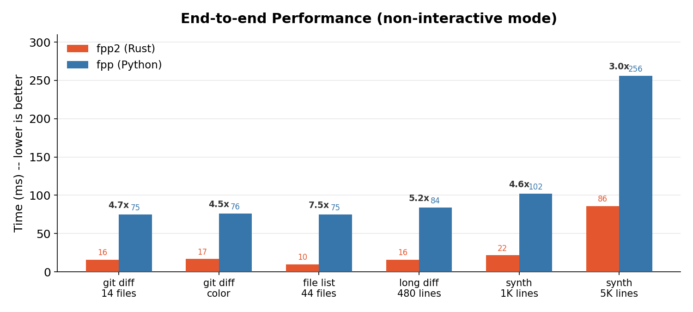

# fpp2 -- Fast PathPicker

A high-performance Rust drop-in replacement for Facebook's [PathPicker](https://github.com/facebook/PathPicker). Install `fpp2` and use it anywhere you used `fpp`.

- [Why a Rewrite?](#why-a-rewrite)
  - [Benchmarks](#benchmarks)
- [Compatibility with Original PathPicker](#compatibility-with-original-pathpicker)
- [Examples](#examples)
- [Installation](#installation)
- [Usage](#usage)
  - [CLI Arguments](#cli-arguments)
  - [Keyboard Shortcuts](#keyboard-shortcuts)
  - [Environment Variables](#environment-variables)
  - [Editor Integration](#editor-integration)
  - [tmux-fpp (tmux integration)](#tmux-fpp-tmux-integration)
  - [All-Input Mode](#all-input-mode)
  - [Non-Interactive Mode](#non-interactive-mode)
  - [Keep-Open Mode](#keep-open-mode)
- [Development](#development)
  - [Test Strategy](#test-strategy)
- [License](#license)

## Why a Rewrite?

The [original PathPicker](https://github.com/facebook/PathPicker) is a Python script that spawns multiple subprocesses (bash wrapper -> Python parser -> pickle -> Python UI -> bash executor). This Rust rewrite:

- Single ~2MB binary with zero runtime dependencies
- Single-process architecture -- no intermediate serialization, no subprocess chain
- 2-5x faster end-to-end, 3-5x less memory

### Benchmarks

Measured on Apple M1 Max (10 cores, 64GB) with [hyperfine](https://github.com/sharkdp/hyperfine) (warmup 3, runs 10). Reproduce with `make bench-e2e`.



| Metric | Speedup | Notes |
|--------|---------|-------|
| Startup | 8-20x | 2ms vs 65ms (native binary vs Python interpreter) |
| Real-world inputs | 5-8x | git diff, grep output, file lists |
| File validation | 7-11x | Default mode -- single-process `stat()` vs subprocess + pickle |
| Memory | 3-4x less | 7MB vs 23MB at 1K lines, 76MB vs 263MB at 50K |

Details: [docs/benchmarks.md](docs/benchmarks.md) (test environment, methodology, full tables).

## Compatibility with [Original PathPicker](https://github.com/facebook/PathPicker)

All CLI arguments, keyboard shortcuts, environment variables, and regex patterns are 100% compatible with the [original](https://github.com/facebook/PathPicker). The following table summarizes feature parity:

| Area | Coverage | Details |
|------|----------|---------|
| CLI arguments | 10/10 | `-c`, `-e`, `-nfc`, `-ai`, `-ni`, `-a`, `--clean`, `-r`, `-ko`, `--debug` |
| Regex patterns | 13/13 | Identical waterfall from `HOMEDIR_REGEX` through `ENTIRE_TRIMMED_LINE` |
| Keyboard shortcuts | 13/13 | Navigation, selection, mode switching all matched |
| Editor integration | 13/13 editors | vim, nvim, mvim, vi, subl, sublime, atom, hx, nano, joe, emacs, emacsclient, micro |
| UI modes | 4/4 | Normal, Command, QuickSelect, Warning |
| Environment variables | 9/9 | `FPP_EDITOR`, `VISUAL`, `EDITOR`, `FPP_DIR`, `FPP_DISABLE_SPLIT`, `FPP_LINENUM_SEP`, `FPP_REPOS`, `SHELL`, `VIMRUNTIME` |
| Screen tests | 34/34 | All original Python screen tests ported and passing |
| E2E snapshots | 538 cases | Verified identical output against the original Python implementation |

Known differences (non-breaking):

- Short flags: `-nfc`, `-ai`, `-ni`, `-ko` (original) and `--nfc`, `--ai`, `--ni`, `--ko` (added) -- both work
- State files use JSON instead of Python pickle -- run `--clean` to reset when switching from the original
- Single-process -- the original's bash wrapper (`fpp` shell script) is not needed

## Examples

fpp2 accepts a wide variety of input -- output from `git`, `grep`, `find`, and any other command -- and presents matching file paths in an interactive terminal UI for selection.

```bash
git status | fpp2
git grep "FooBar" | fpp2
grep -r "FooBar" . | fpp2
git diff HEAD~1 --stat | fpp2
find . -iname "*.js" | fpp2
```

Selected files are opened in `$EDITOR` by default. Press `c` during selection to enter command mode, or specify a command upfront:

```bash
# Stage selected files
git status | fpp2 -c "git add"

# Delete selected temp files
find . -name "*.tmp" | fpp2 -c "rm"

# Use $F to place filenames mid-command
git log --oneline | fpp2 -c 'git show $F'
```

## Installation

### Homebrew (macOS / Linux)

```bash
brew tap devinjeon/FastPathPicker https://github.com/devinjeon/FastPathPicker
brew install fpp2
```

### From Source

```bash
git clone https://github.com/devinjeon/FastPathPicker.git
cd FastPathPicker
make build      # release build
make install    # installs to ~/.cargo/bin/fpp2
```

### With Cargo

```bash
cargo install --path .
```

## Usage

### CLI Arguments

| Argument | Description |
|----------|-------------|
| `-c`, `--command <CMD>` | Command to run on selected files |
| `-e`, `--execute-keys <KEYS>` | Auto-execute keys on startup (e.g., `-e END`) |
| `-nfc`, `--no-file-checks` | Disable filesystem validation for matched paths |
| `-ai`, `--all-input` | Treat every input line as a selectable match |
| `-ni`, `--non-interactive` | Execute command non-interactively (no UI) |
| `-a`, `--all` | Auto-select all files on startup |
| `--clean` | Remove all state files before starting |
| `-r`, `--record` | Record input/output for debugging |
| `-ko`, `--keep-open` | Stay open after execution (loop until Ctrl-C) |
| `--debug` | Print execution directory |

### Keyboard Shortcuts

| Key | Action |
|-----|--------|
| `j` / `Down` | Move cursor down |
| `k` / `Up` | Move cursor up |
| `Space` / `PageDown` | Page down (50% of viewport) |
| `b` / `PageUp` | Page up (50% of viewport) |
| `g` / `Home` | Jump to first match |
| `G` / `End` | Jump to last match |
| `f` | Toggle file selection |
| `F` | Toggle selection and move down |
| `A` | Toggle select all (unique files) |
| `x` | Quick-select mode (labels each line) |
| `c` | Enter command mode |
| `d` | Show file description (until next cursor move) |
| `Enter` | Open selected files in editor |
| `q` | Quit without action |
| `Esc` | Exit command mode or quick-select mode |
| `Ctrl-C` | Quit immediately (no script execution) |

Custom key bindings: `~/.cache/fpp/.fpp.keys` (INI format, `[bindings]` section).

### Environment Variables

| Variable | Description |
|----------|-------------|
| `FPP_EDITOR` | Editor override (highest priority) |
| `VISUAL` | Editor (if `FPP_EDITOR` not set) |
| `EDITOR` | Editor fallback (defaults to `vim`) |
| `FPP_DIR` | State directory (default: `$XDG_CACHE_HOME/fpp` or `~/.cache/fpp`) |
| `FPP_DISABLE_SPLIT` | Disable vim vertical split panes |
| `FPP_LINENUM_SEP` | Custom line number separator for unsupported editors |
| `FPP_REPOS` | Additional repo root directories (comma-separated) |
| `SHELL` | Shell used for command execution |
| `VIMRUNTIME` | Detected to avoid `-i` flag when running inside vim |

### Editor Integration

fpp2 detects your editor and formats arguments with line numbers accordingly:

| Editor | Format | Example |
|--------|--------|---------|
| vim, nvim, mvim | Vertical splits with `+linenum` | `vim +10 file1 +"vsp +20 file2"` |
| vim -p | Tab pages | `vim -p +10 file1 +20 file2` |
| subl, atom, hx | `file:linenum` | `subl file1:10 file2:20` |
| nano, joe, emacs, emacsclient, micro, vi | `+linenum file` | `nano +10 file1 +20 file2` |

Paths with spaces are automatically quoted. `FPP_DISABLE_SPLIT` opens each file in a separate vim buffer instead of splits.

### tmux-fpp (tmux integration)

[tmux-fpp](https://github.com/tmux-plugins/tmux-fpp) grabs file paths from the current tmux pane and pipes them into PathPicker. To use fpp2 instead of the original fpp:

```tmux
# .tmux.conf
set -g @plugin 'tmux-plugins/tmux-fpp'
set -g @fpp-key 'x'
set -g @fpp-path '/path/to/fpp2'   # point to fpp2 binary
```

After reloading tmux config, press `prefix + x` to pick files from the current pane.

### All-Input Mode

Treat every line as selectable, even if it doesn't look like a file path:

```bash
git branch | fpp2 -ai -nfc -c "git checkout"
echo -e "option1\noption2\noption3" | fpp2 -ai -nfc
```

### Non-Interactive Mode

Execute a command without showing the UI (selects all matched files automatically):

```bash
git status | fpp2 -ni -c "git add"
```

### Keep-Open Mode

Re-run the selection loop after each command execution:

```bash
git status | fpp2 -ko -c "git add"
# After each selection, fpp2 returns to the UI until you press Ctrl-C
```

## Development

```bash
make dev          # debug build
make build        # release build (LTO, stripped)
make test         # all tests
make test-unit    # unit tests only
make test-integ   # integration tests (screen rendering + stdin handling)
make test-e2e     # e2e snapshot tests (vs original Python fpp)
make lint         # clippy + fmt check
make qa           # compare output with original PathPicker
make bench-e2e    # performance benchmarks vs original
```

### Test Strategy

Tests focus on ensuring compatibility with the original PathPicker:

- All 34 screen tests from the original ported 1:1 to verify identical UI behavior
- 66 of the original's 84 file matching test cases included in the parsing suite
- 538 e2e snapshots verify identical output against the original Python implementation (`make qa`)
- Additional tests not in the original: stdin pipe handling, ANSI escape parsing, state serialization, editor command generation

## License

MIT
