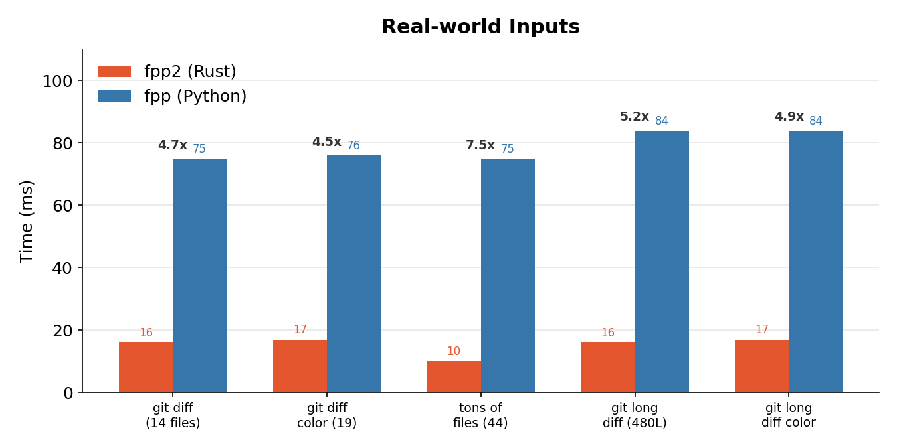
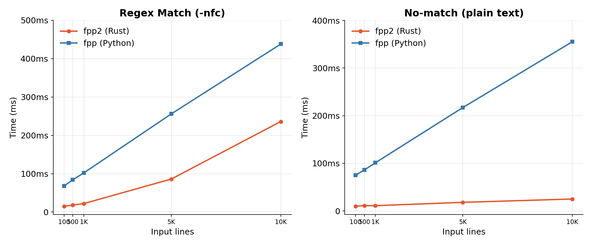
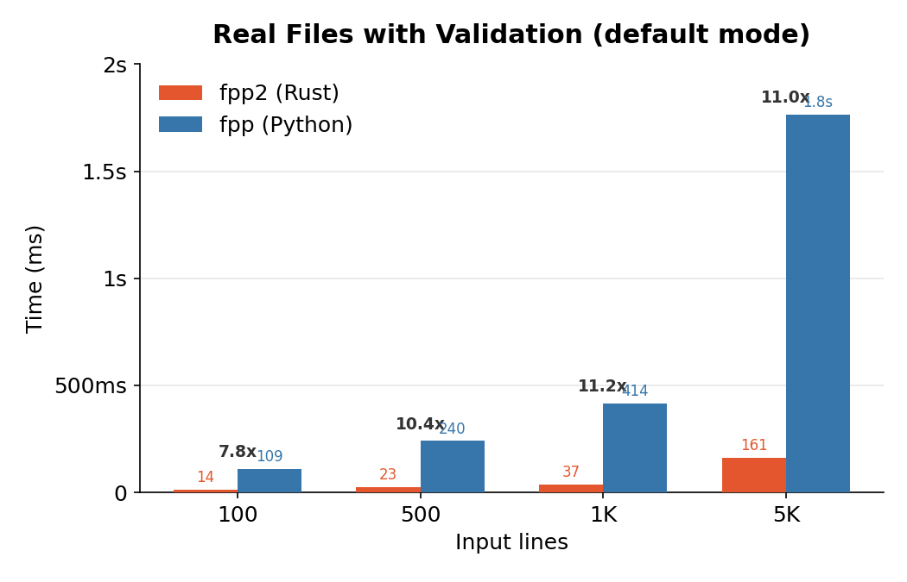
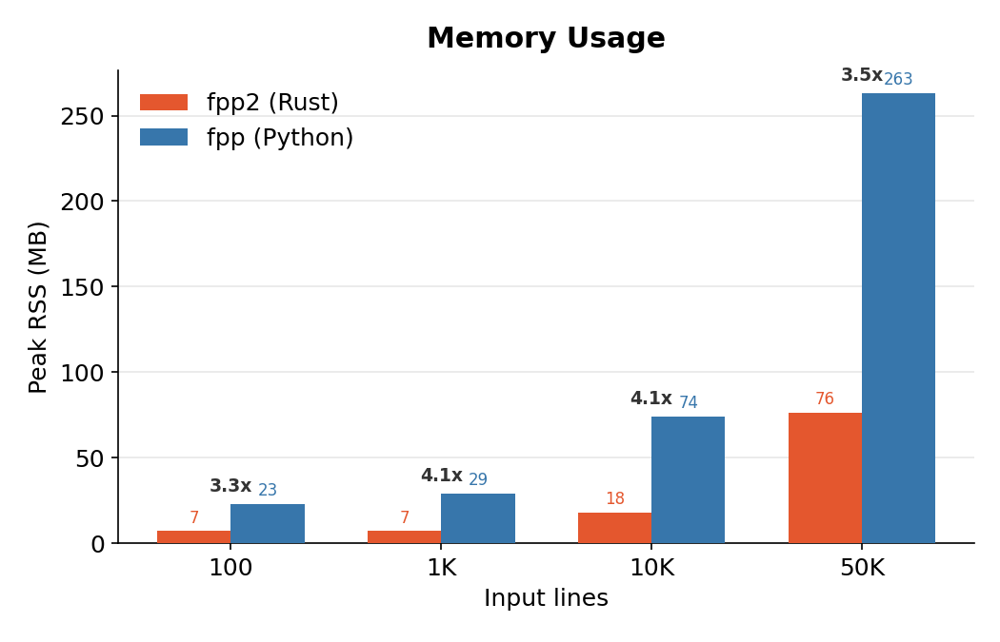

# Benchmarks

fpp2 is a Rust rewrite of Facebook's [PathPicker](https://github.com/facebook/PathPicker) (Python). This document compares end-to-end performance between the two implementations to validate that the rewrite delivers measurable improvement in the scenarios users actually encounter.

The original PathPicker is written in Python and uses a multi-process architecture (bash wrapper -> Python parser -> pickle serialization -> Python UI -> bash executor). fpp2 replaces this with a single native binary that handles everything in one process.

## Test Environment

| | |
|---|---|
| CPU | Apple M1 Max (10 cores: 8 performance + 2 efficiency) |
| RAM | 64 GB |
| OS | macOS 26.3.1 (Darwin 25.3.0) |
| fpp2 | rustc 1.94.1 (2026-03-25), release build |
| Original PathPicker | Python 3.14.3, [facebook/PathPicker](https://github.com/facebook/PathPicker) |
| Benchmark tool | [hyperfine](https://github.com/sharkdp/hyperfine) 1.20.0 |

## Methodology

- hyperfine: warmup 3 runs, 10 measured runs per test. Results show mean +/- standard deviation.
- Each run creates a fresh temp directory (`mktemp -d`) for state files to eliminate caching.
- Memory: `/usr/bin/time -l` peak RSS, median of 5 samples, process measured directly (no shell wrapper).
- Python comparison uses a [headless runner](../tests/e2e/fpp_headless.py) that calls the original PathPicker's parsing and output functions directly, equivalent to fpp2's `--non-interactive` mode.
- Both sides receive identical input via stdin and produce the same output script.

Reproduce:

```bash
make bench-e2e          # full (10 runs, ~30 min)
make bench-e2e-rust     # rust-only
# or with --quick (3 runs, warmup 1):
bash tests/e2e/bench_e2e.sh --quick
```

## Results

### Startup

| Scenario | Rust | Python | Speedup |
|----------|------|--------|---------|
| `--help` | 2ms | 39ms | 20x |
| Empty input | 8ms | 65ms | 8x |

The gap is Python interpreter startup (~65ms) vs native binary launch (~2ms).

### Real-world Inputs

Actual git diff and file listing output from `tests/inputs/`.



| Input | Rust | Python | Speedup |
|-------|------|--------|---------|
| git diff (14 files) | 16ms | 75ms | 4.7x |
| git diff with color (19 files) | 17ms | 76ms | 4.5x |
| tons of files (44 files) | 10ms | 75ms | 7.5x |
| git long diff (480 lines) | 16ms | 84ms | 5.2x |
| git long diff with color | 17ms | 84ms | 4.9x |

### Scaling (synthetic input, `-nfc`)

Generated grep-style lines (`src/module_N/file_N.rs:LINE: fn function_N()`), file checks disabled.



| Lines | Rust | Python | Speedup |
|-------|------|--------|---------|
| 100 | 15ms | 68ms | 4.6x |
| 500 | 18ms | 84ms | 4.7x |
| 1,000 | 22ms | 102ms | 4.6x |
| 5,000 | 86ms | 256ms | 3.0x |
| 10,000 | 236ms | 438ms | 1.9x |


The speedup narrows at larger inputs due to the 13-pattern regex waterfall becoming the dominant cost.

### No-match (plain text)

Input lines that don't match any file path regex.

| Lines | Rust | Python | Speedup |
|-------|------|--------|---------|
| 100 | 10ms | 75ms | 7.4x |
| 1,000 | 11ms | 101ms | 9.0x |
| 10,000 | 25ms | 355ms | 14.3x |

Rust's regex engine rejects non-matching lines very quickly.

### Real Files (with validation)

Actual file paths on disk, file existence check enabled (default mode, no `-nfc`).



| Lines | Rust | Python | Speedup |
|-------|------|--------|---------|
| 100 | 14ms | 109ms | 7.5x |
| 500 | 23ms | 240ms | 10.3x |
| 1,000 | 37ms | 414ms | 11.3x |
| 5,000 | 161ms | 1,766ms | 11.0x |

The original Python pays per-file overhead through subprocess architecture and pickle serialization. fpp2 calls `stat()` directly in the same process.

### Memory (peak RSS)



| Lines | Rust | Python | Ratio |
|-------|------|--------|-------|
| 100 | 7MB | 23MB | 3.3x |
| 1,000 | 7MB | 29MB | 4.1x |
| 10,000 | 18MB | 74MB | 4.0x |
| 50,000 | 76MB | 263MB | 3.5x |

Python's baseline ~23MB is the interpreter itself. Rust uses 3-4x less memory at all input sizes.
